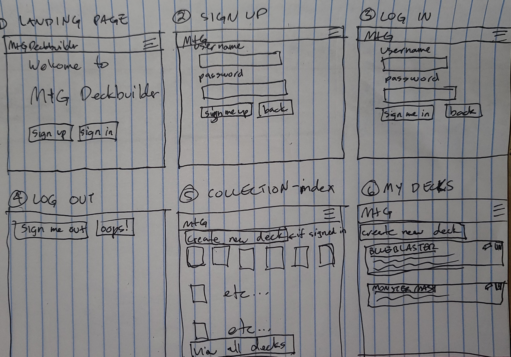
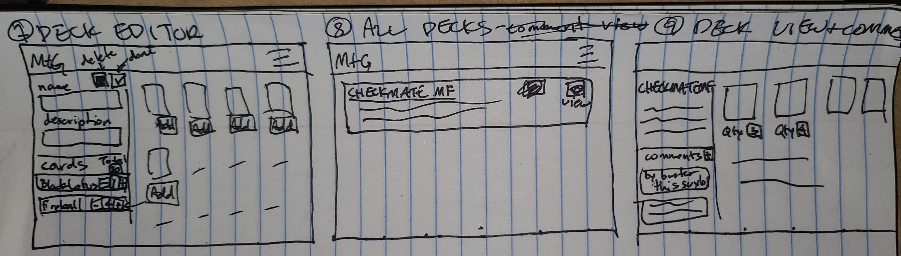
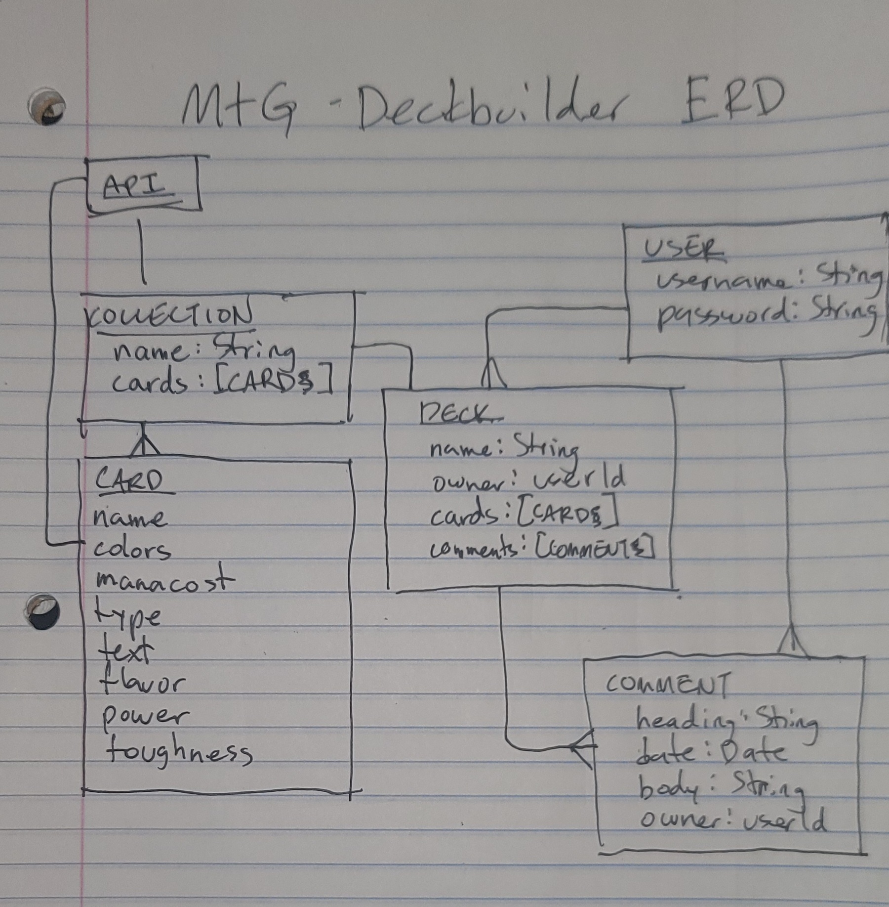

# MtG Deckbuilder App

## Overview

MtG Deckbuilder allows a group of people to create a tournament style MtG deck from a collection of cards. It also allows all registered users to comment on any deck.

## Goals Summary

Create a collection of 'approved' cards pulled from the MtG api, then each user may build decks from those cards, giving their freinds the opportunity to troll them endlessly with comments.

### Sprints

#### Day One

Basic styling objectives:

-   colors
-   fonts

### MVP

-   user authentication and authorization, including signup, login, and log out
-   create a collection of 'allowed' cards based on certain MtG releases. This will be haedcoded in the schema for mvp.
-   users will be able to choose cards from the collection
-   decks will just be another collection (not a competition style deck with dechbuilding rules)

### Stretch Goals

-   a collection can be created or edited dynamically by allowing choosing cards from certain releases or other factors
-   add rules to deckbuilding similar to MtG rules (need certain # of land, only allow so many of each card, etc)
-   basic sorting on collection and deck views (by color/type/etc)

## User Stories

-   as a user, i want to sign up for an account
-   as a user, if i'm not logged in, i want to login to my account
-   as a user, if i'm logged in:
    -   i want to be able to log out
    -   i want to be able to view all cards in the (allowed) collection
    -   i want to be able to create a new deck
    -   i want to be able to create as many new decks as i want
    -   i want to be able to add card(s) from the collection to any deck
    -   i want to be able to remove card(s) from any deck
    -   i want to be able to delete a deck
    -   i want to be able to comment on any deck (my own or any registered user)
    -   i want to able to edit any comments i have made
    -   i want to be able to delete any comments i have made

## Technologies Used

-   html
-   css (w/ bootstrap)
-   javascript
-   express
-   mongodb
-   mongoose
-   nodejs
-   liquidjs

## Routes Tables

#### Decks

| **URL**         | **HTTP Verb** | **Action** |
| --------------- | ------------- | ---------- |
| /decks/         | GET           | index      |
| /decks/:id      | GET           | show       |
| /decks/new      | GET           | new        |
| /decks          | POST          | create     |
| /decks/:id/edit | GET           | edit       |
| /decks/:id      | PATCH/PUT     | update     |
| /decks/:id      | DELETE        | destroy    |

#### Comments

| **URL**                             | **HTTP Verb** | **Action** |
| ----------------------------------- | ------------- | ---------- |
| /comments/:deckId                   | POST          | create     |
| /comments/delete/:deckId/:commentId | DELETE        | destroy    |

#### Users

| **URL**       | **HTTP Verb** | **Action** |
| ------------- | ------------- | ---------- |
| /users/signup | POST          | create     |
| /users/login  | POST          | create     |
| /users/logout | DELETE        | destroy    |

## Wireframes

#### Notes:

-   not sure i will need a collection view, since a user can view all of the collected cards in their deckbuilding view -- seems redundant
-   there will technically be a separate create deck screen and edit deck screen, but they will look almost exactly the same (#7). they will have different route structures and HTTP verbs
-   I also might do a 'fancier' login screen with a sign up link, instead of have the sign up button on the landing page. more modern a bit more logical.

## ERD

### API Data Flow

-   CREATE Deck:
    -   page loads with form on left and all cards on right
